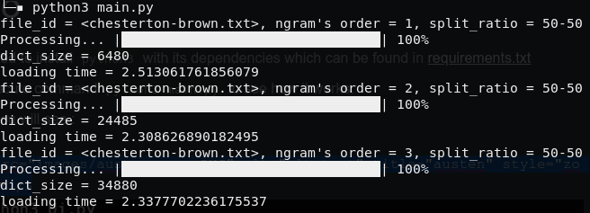

# Abstract

Ngram is a type of language model for predicting the next item in a sequence. POS-Ngram is an improved model that integrates part-of-speech with the Ngram. In this study, we employ the POS-Ngram model to augment the ability of a word suggestion system to predict not only words but also provide grammatical information. Please refer to this [slide](https://github.com/Suineg-Darhnoel/Prototypes/blob/master/slide/fslide.pdf) for detailed explanation.

# Goal

In this project, I developed a prototyped UI application for text typing in English. The purpose of the application is aimed for word suggestion based on the above mentioned method which is simple yet a powerful one. The implementation is to demonstrate the simplicity of a probabilistic model in real life. Therefore, improvements on suggestion performance and the UI design are not considered the main points here. However, It would be a great pleasure if there are more contributions for any future improvements.

# Demo

- You need to install `python3` with its dependencies which can be found in [requirements.txt](https://github.com/Suineg-Darhnoel/Prototypes/blob/master/requirements.txt)
- the execute command `python3 main.py` to see how it works.
- Then you will see :

